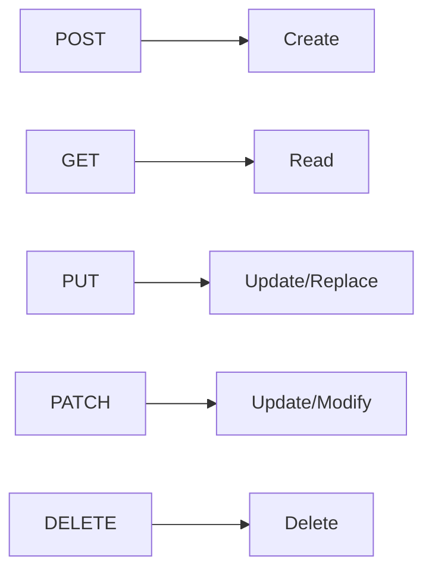
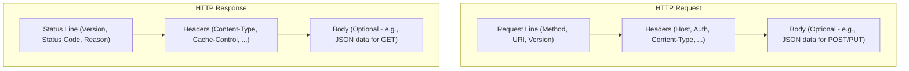

# Understanding REST APIs: A Primer

Welcome! This document provides a brief introduction to REST APIs, complementing the interactive `demo.md` workbook. Understanding these concepts will help you grasp how modern web services communicate.

## Why are REST APIs Important?

Imagine different software applications needing to talk to each other over the internet. How do they do it reliably and efficiently? REST APIs are a common answer.

*   **Web Services:** They power the dynamic content you see on websites and mobile apps. When you check the weather, browse social media, or book a flight online, chances are REST APIs are working behind the scenes to fetch and update data.
*   **Microservices:** Modern applications are often built as a collection of smaller, independent services (microservices). REST APIs are the "glue" that allows these services to communicate and collaborate.
*   **Integration:** They enable different systems, even those built with different technologies, to integrate and share data (e.g., connecting your calendar app to your email).
*   **Standardization:** REST provides a standardized way to build web services, making them easier to understand, consume, and maintain.

## What is REST?

REST stands for **RE**presentational **S**tate **T**ransfer. It's not a strict protocol like SOAP, but rather an architectural style – a set of constraints and principles for designing networked applications. When an API follows these principles, we call it a "RESTful" API.

### Core REST Principles

1.  **Client-Server:** The client (e.g., your browser, a mobile app) is responsible for the user interface, while the server is responsible for storing and managing data. They are separate concerns and communicate over a network.

    ```mermaid
    sequenceDiagram
        participant Client
        participant Server
        Client->>Server: HTTP Request (e.g., GET /users/123)
        Server-->>Client: HTTP Response (e.g., 200 OK + User Data)
    ```
2.  **Statelessness:** Each request from the client to the server must contain all the information needed to understand and process the request. The server does not store any client context (state) between requests. If state is needed (like knowing who is logged in), the client sends it with each request (e.g., via an authentication token).
3.  **Cacheability:** Responses from the server should indicate whether they can be cached by the client or intermediaries. Caching improves performance and reduces server load.
4.  **Uniform Interface:** This is a key constraint that simplifies and decouples the architecture. It has several sub-constraints:
    *   **Resource Identification:** Resources (data entities like users, documents, etc.) are identified by URIs (Uniform Resource Identifiers), like `http://example.com/users/123`.
    *   **Resource Manipulation Through Representations:** Clients interact with resources via their representations (commonly JSON or XML). The representation sent back by the server contains enough information for the client to modify or delete the resource.
    *   **Self-Descriptive Messages:** Each request and response contains enough information for the recipient to understand it (e.g., `Content-Type` header indicating the format is JSON).
    *   **HATEOAS (Hypermedia as the Engine of Application State):** Optionally, responses can include links (hypermedia) that guide the client on what actions they can take next.
5.  **Layered System:** Intermediaries (like load balancers, proxies, gateways) can exist between the client and the server without the client needing to know. Each layer only sees the interaction with the next layer.
6.  **Code on Demand (Optional):** Servers can temporarily extend client functionality by transferring executable code (e.g., JavaScript), though this is less common in typical REST APIs.

## HTTP Methods (Verbs)

REST APIs leverage standard HTTP methods, often mapping to CRUD (Create, Read, Update, Delete) operations:



*   **`POST` (Create):** Create a new resource. (e.g., sign up a new user). Not Idempotent (usually).
*   **`GET` (Read):** Retrieve a representation of a resource. (e.g., get user details). Safe and Idempotent.
*   **`PUT` (Update/Replace):** Replace an existing resource entirely. (e.g., update a user's profile completely). Idempotent.
*   **`PATCH` (Update/Modify):** Apply partial modifications to an existing resource. (e.g., update only the user's email address). Not necessarily Idempotent.
*   **`DELETE` (Delete):** Remove a resource. (e.g., delete a document). Idempotent.

## HTTP Status Codes

Servers respond with status codes to indicate the outcome of a request:

*   **`2xx` (Success):**
    *   `200 OK`: Standard success response for GET, PUT, PATCH.
    *   `201 Created`: Resource was successfully created (often used with POST).
    *   `204 No Content`: Success, but there's no data to return (often used with DELETE or PUT/PATCH where returning the object isn't needed).
*   **`3xx` (Redirection):**
    *   `301 Moved Permanently`: Resource URI has changed.
    *   `304 Not Modified`: Used for caching; resource hasn't changed since last request.
*   **`4xx` (Client Errors):**
    *   `400 Bad Request`: Malformed request syntax, invalid parameters.
    *   `401 Unauthorized`: Authentication is required and has failed or not been provided.
    *   `403 Forbidden`: Authenticated, but lacks permission to access the resource.
    *   `404 Not Found`: The requested resource does not exist.
    *   `405 Method Not Allowed`: The HTTP method used is not supported for this resource.
    *   `409 Conflict`: Request conflicts with the current state of the resource (e.g., trying to create a user with an email that already exists).
*   **`5xx` (Server Errors):**
    *   `500 Internal Server Error`: A generic error occurred on the server.
    *   `503 Service Unavailable`: The server is temporarily unable to handle the request (overloaded or down for maintenance).

## Request/Response Structure

A typical HTTP request/response cycle involves these components:



1.  **Request Line / Status Line:** The first line indicating the request action or the response outcome.
    *   *Request Example:* `GET /documents/xyz HTTP/1.1`
    *   *Response Example:* `HTTP/1.1 200 OK`
2.  **Headers:** Key-value pairs providing metadata about the request or response.
    *   *Common Request Headers:* `Host`, `Authorization`, `Accept`, `Content-Type`
    *   *Common Response Headers:* `Content-Type`, `Content-Length`, `Cache-Control`
3.  **Body (Optional):** Contains the actual data (representation) being transferred.
    *   *Request Body:* Used with `POST`, `PUT`, `PATCH` to send data.
    *   *Response Body:* Used with `GET` to return data, or with `POST`/`PUT` to return details of the created/updated resource.

## Idempotency

An operation is **idempotent** if making the same request multiple times produces the same result as making it once.

*   `GET`, `PUT`, `DELETE` are typically idempotent. Getting the same resource multiple times doesn't change it. Replacing a resource with the same data multiple times yields the same final state. Deleting a resource multiple times means it's deleted after the first time.
*   `POST` is generally *not* idempotent. Sending the same `POST` request multiple times usually creates multiple new resources.
*   `PATCH` *may or may not* be idempotent, depending on the nature of the partial update.

Idempotency is important for building reliable systems, especially in cases where network errors might cause a client to retry a request.

---

This overview should provide a good foundation for understanding the concepts demonstrated in the `demo.md` workbook. Happy coding!